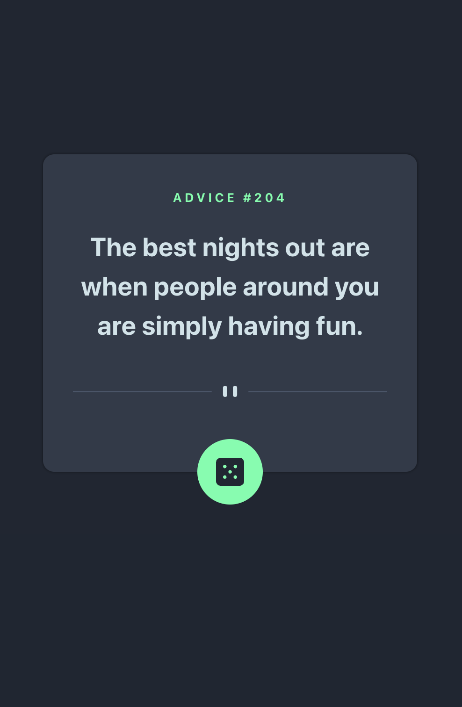
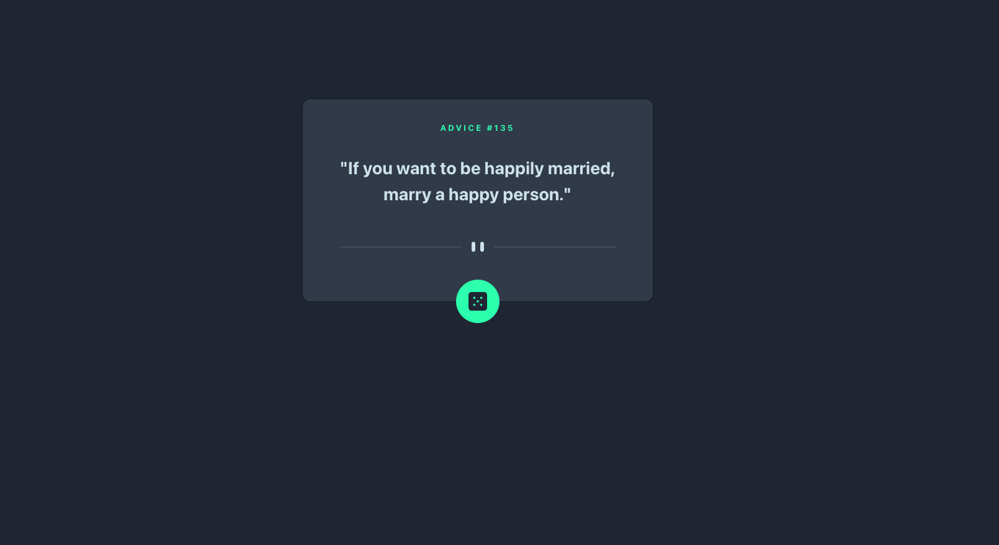

# Frontend Mentor - Advice generator app solution

This is a solution to the [Advice generator app challenge on Frontend Mentor](https://www.frontendmentor.io/challenges/advice-generator-app-QdUG-13db). Frontend Mentor challenges help you improve your coding skills by building realistic projects.

## Table of contents

- [Overview](#overview)
  - [The challenge](#the-challenge)
  - [Screenshot](#screenshot)
  - [Links](#links)
- [My process](#my-process)
  - [Built with](#built-with)
  - [What I learned](#what-i-learned)
  - [Continued development](#continued-development)
  - [Useful resources](#useful-resources)
- [Author](#author)


## Overview

### The challenge

Users should be able to:

- View the optimal layout for the app depending on their device's screen size
- See hover states for all interactive elements on the page
- Generate a new piece of advice by clicking the dice icon

### Screenshot





### Links

- Solution URL: [GitHub Solution](https://github.com/Rae1821/advice-generator)
- Live Site URL: [Add live site URL here](https://your-live-site-url.com)

## My process

### Built with

- Semantic HTML5 markup
- CSS custom properties
- Flexbox
- Mobile-first workflow
- [React](https://reactjs.org/) - JS library

### What I learned

I am currently learning how to use React so I decided to try it out for this project. I feel that this project gave me a better understanding of how props work. It was also a great way to practice using the useState() and useEffect() hooks in React.

It was also a great way to practice using the Create React App and setting up my local environment to use it effectively. 

I built the entire project and then realized there are two different images for the divider, a desktop version and a mobile version. I decided to use the window.innerWidth property to conditionally render the image based on the size of the window. I am proud of figuring that out myself!


```js

```


### Continued development

Definitely want to learn more about styled components in React and start getting more comfortable using it in larger projects. Practice makes perfect!


### Useful resources

- [W3 Schools](https://www.w3schools.com/js/default.asp) - This continues to be one of my favorite go to resources.
- [Create React App Docs](https://create-react-app.dev/docs/getting-started) - Create React App has great documentation and really helped me a lot.


## Author

- Website - [Rachel Dooley](https://www.rachelandersondooley.com)
- Frontend Mentor - [@Rae1821](https://www.frontendmentor.io/profile/Rae1821)
- Twitter - [@RachelADooley](https://www.twitter.com/racheladooley)


